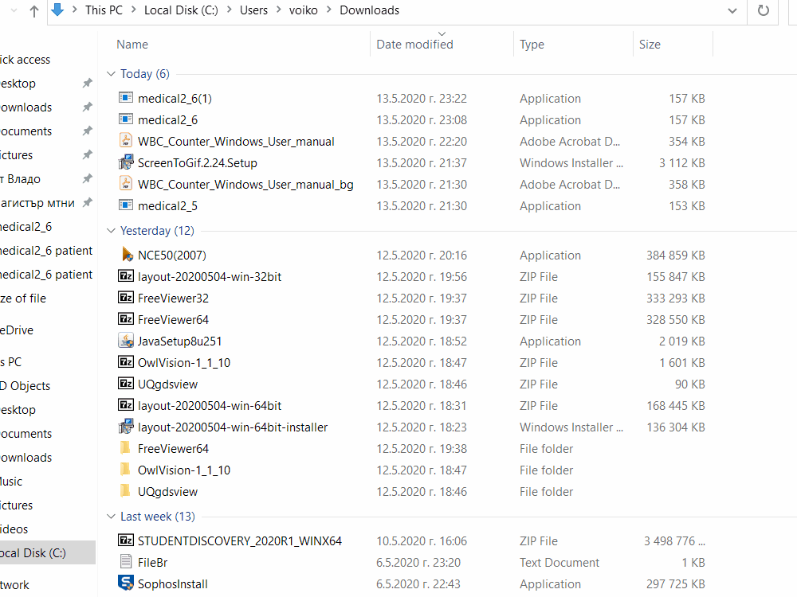

# Software - Manual WBC Differential Counter (Software program for manually counting blood cells with microscope)
# Софтуер - Ръчен WBC Диференциален Брояч (Софтуерна програма за ръчно броене на кръвни клетки с микроскоп)

This is a software program for counting blood cells with microscope, also known as differential counting. It is a medical software. The primary goal of this software is to imitate the function of 8 button WBC (White Blood Cell) differential counter.
The program works on Windwos 10, Windows 7 and Windows XP. For Windows XP download the 32 bit version of the program. Before working with the program read the user manual.
IMPORTANT!!! If your OS is Windows XP or Windows 7 you have to do mandatory setup. Please download mandatory setup.pdf
You can check the new version of the program medical2_6.exe it now supports name, date and history of old results saved in .txt file!

If you have problems with the program or suggestions write an email to voikovi@abv.bg

How to use the program:
Program for counting blood cells with microscope.
Counting is done manually by the keyboard of the computer.
After openning the program to start counting  enter '1' and hit Button 'Enter'.
The sample count table can be seen in  pic2.jpg and pic3.jpg .

For column BASO. press button C; For column EOSIN. press button V; For column MYELO. press button B
For column JUVEN. press button N; For column STAB. press button M; For column SEG. press button <
For column LYMPH. press button >; For column MONO. press button ?
| ! | In order to operate with the program the keyboard language must be set to English.
Special commands are: Button 0 -> Set counter to zero; Button 7 -> Save; Button 9 -> Exit

This program will be useful to medical clinical laboratories.
Preview of the program can be found in pic1.jpg pic2.jpg pic3.jpg pic4.jpg .

bg language:
Програма за ръчно броене на клетки с микроскоп.
Броенето става ръчно чрез клавиатурата.
След отварянето на програмата, за да започне броенето натиснете '1' и натиснете 'Enter'.
Примерната таблица на броене може да бъде видяна в pic2.jpg и pic3.jpg .

За колона BASO. натисни бутон C; За колона EOSIN. натисни бутон V За колона MYELO. натисни бултон B
За колона JUVEN. натисни бутон N; За колона STAB. натисни бутон M; За колона SEG. натисни бутон <
За колона LYMPH. натисни бутон >; За колона MONO. натисни бутон ?
| ! | За да работи програмата, екикът на клавиатурата трябва да е английски.
Специални команди по време на броене Бутон 0 -> нулиране на брояча; Бутон 7 -> Запис във файл; Бутон 9 -> Изход.
